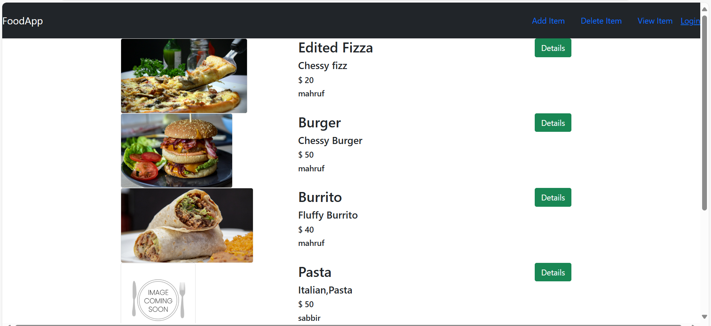
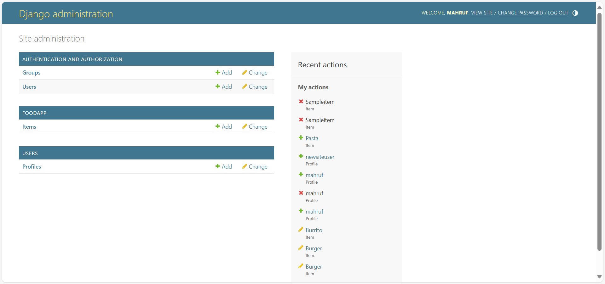

# FoodApp

FoodApp is a Django-based web application that allows users to manage food items. Users can add, view, and delete food items through an intuitive interface. The application is built with Django for backend functionality and includes a basic frontend to showcase the food items.

## Features

- **Add Items**: Authenticated users can add food items with details such as name, description, price, and image.
- **View Items**: All users can view the list of food items displayed with images, descriptions, and prices.
- **Delete Items**: Authenticated users can delete existing food items.
- **Authentication**: Login and logout functionality is provided for user authentication.
- **Admin Panel**: Admins can manage food items and user profiles via the Django admin panel.

## Technologies Used

- **Backend**: Django (Python)
- **Frontend**: HTML, CSS (Bootstrap for styling)
- **Database**: SQLite (default Django database)

## Installation and Setup

1. Clone the repository:
   ```bash
   git clone https://github.com/CoderMahruf/FoodApp.git
   ```

2. Navigate to the project directory:
   ```bash
   cd mysite/
   ```

3. Create a virtual environment and activate it:
   ```bash
   python -m venv venv
   source env/Scripts/activate    # On Windows: venv\Scripts\activate
   ```

4. Install the required packages:
   ```bash
   pip install -r requirements.txt
   ```

5. Apply migrations to set up the database:
   ```bash
   python manage.py makemigrations
   python manage.py migrate
   ```

6. Create a superuser to access the admin panel:
   ```bash
   python manage.py createsuperuser
   ```

7. Start the development server:
   ```bash
   python manage.py runserver
   ```

8. Open the application in your browser:
   ```
   http://127.0.0.1:8000/
   ```

## Usage

- **Admin Panel**: Accessible at `http://127.0.0.1:8000/admin/` for managing items and user profiles.
- **Add Items**: Navigate to `Add Item` from the menu (requires login).
- **View Items**: Available for all users to browse food items.
- **Delete Items**: Navigate to `Delete Item` from the menu (requires login).

## Screenshots

### Main Page


### Admin Panel


## Folder Structure

```plaintext
FoodApp/
├── foodApp/           # Main application folder
├── templates/         # HTML templates
├── static/            # Static files (CSS, images, etc.)
├── db.sqlite3         # SQLite database
├── manage.py          # Django management script
├── requirements.txt   # Python dependencies
└── ...
```

## Contributing

Contributions are welcome! If you encounter bugs or have feature requests, feel free to create an issue or submit a pull request.

## License

This project is licensed under the MIT License. See the `LICENSE` file for more details.

---

Enjoy managing your food items with FoodApp!

